<!-- PROJECT LOGO -->
 

  

  <h3 align="center">InmoMarket</h3>

  

    Una increible App inmobiliaria
     
  

<!-- TABLE OF CONTENTS -->

  
Tabla de Contenidos

  <ol>
    <li>
      <a href="#about-the-project">Acerca del Proyecto</a>
      <ul>
        <li><a href="#home-screen">Home Screen</a></li>
        <li><a href="#property-detail-screen">Porperty Detail Screen</a></li>
        <li><a href="#chat-screen">Chat Screen</a></li>
        <li><a href="#messages-screen">Messages Screen</a></li>
        <li><a href="#search-screen">Search Screen</a></li>
        <li><a href="#add-property-screen">Add Property Screen</a></li>
        <li><a href="#profile-screen">Profile Screen</a></li>
        <li><a href="#drawer-screen">Drawer Screen</a></li>
        <li><a href="#settings-screen">Search Screen</a></li>
      </ul>
      <li>Desarrollo</a>
      <ul>
        <li><a href="#contruido-con">Contruido con</a></li>
        <li><a href="#tecnologías-usadas">Tecnologías usadas</a></li>
      </ul>
    </li>
     <li><a href="#como-contribuir">Como contribuir</a></li>
     <li><a href="#code-stats">Code Stats</a></li>
     <li><a href="#license">Licencia</a></li>
  </ol>

<!-- ABOUT THE PROJECT -->
## Acerca del proyecto
 

### Home Screen

  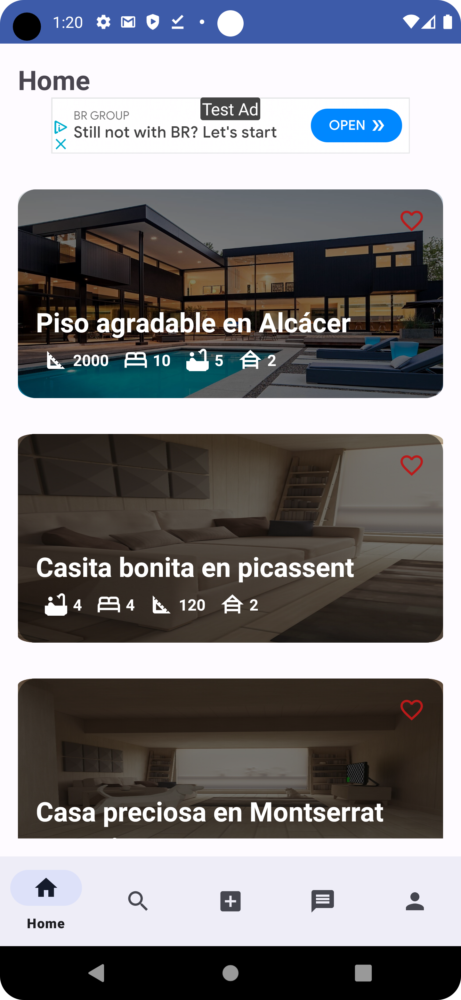

### Property detail Screen

  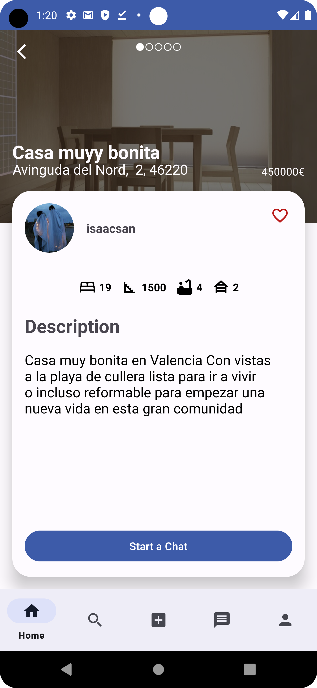

### Chat Screen

  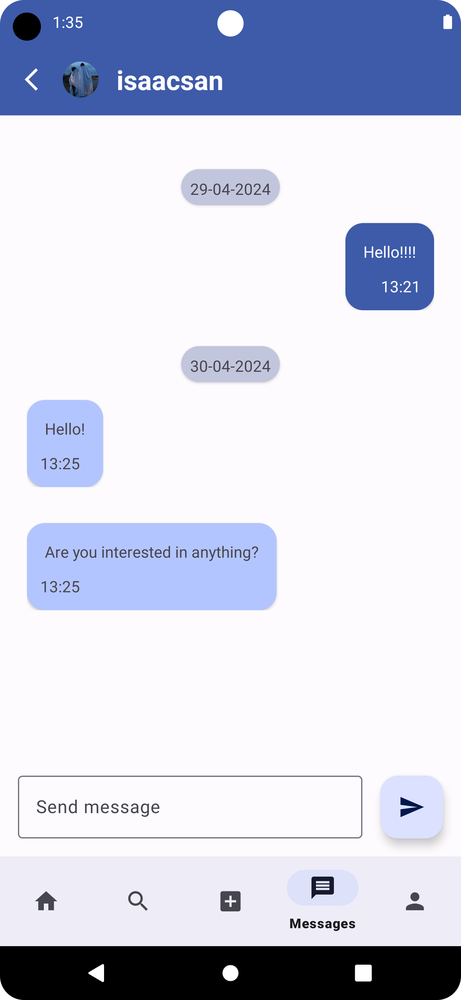

### Messages Screen

  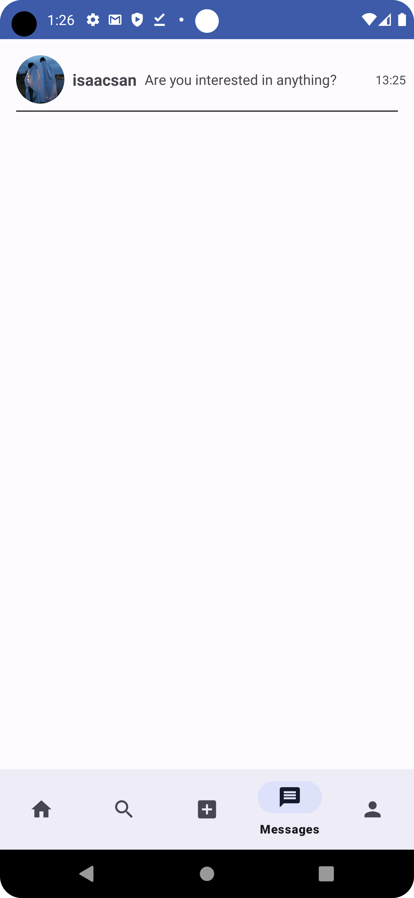

### Search Screen

  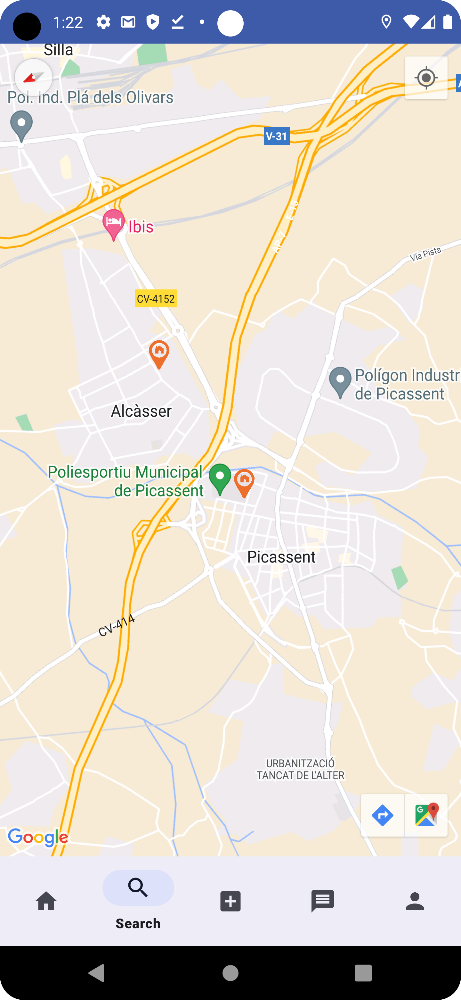

  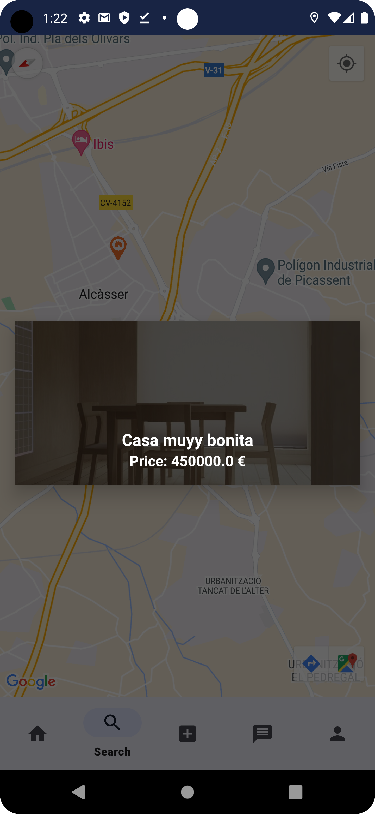

### Add Property Screen

  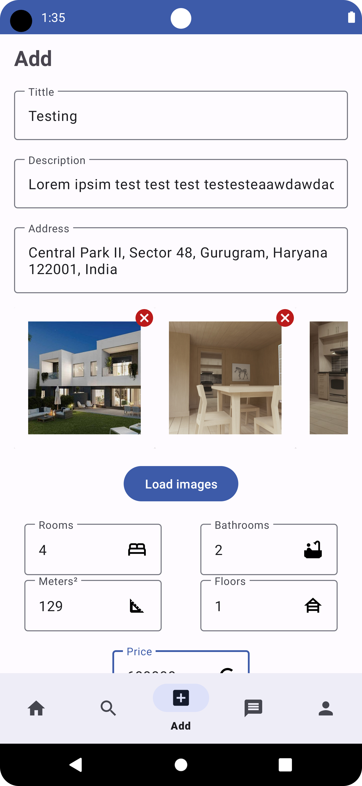

### Profile Screen

  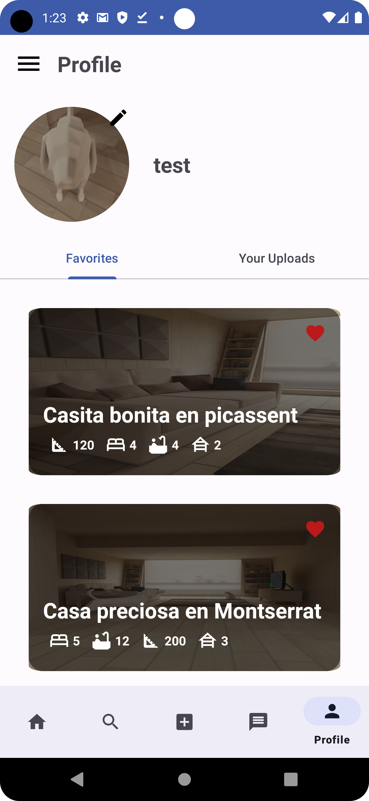

  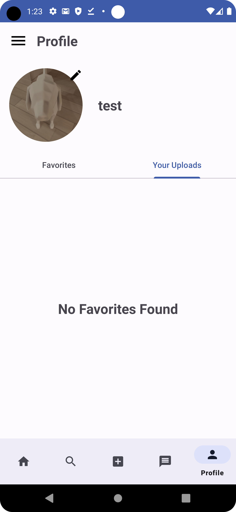

### Drawer Screen

  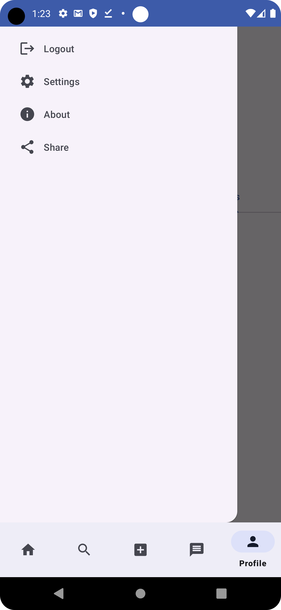

### Settings Screen

  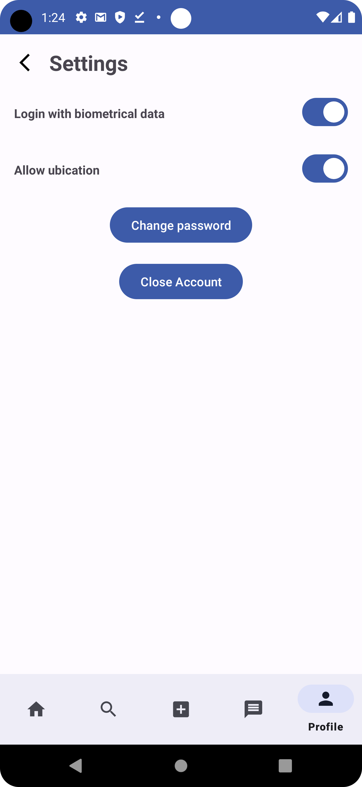

 

### Contruido con

* 
* 
* 
* 

### Tecnologías usadas
* 
* 
* 
* 
* 
* 
* 
* 

<!-- CONTRIBUTING -->
## Como contribuir

¡La contribuciones son gratamente aceptadas!

> [!TIP]
> ¡Si tiene alguna idea o similar házmelo saber en [Feature](https://github.com/Zenin0/InmoMarket/issues/new?assignees=&labels=&projects=&template=feature_request.md&title=Addon).
> ¡También se puede apoyar económicamente [Sponsor](https://buymeacoffee.com/zenin0)!

<!-- Code Stats -->
## Code Stats

[Code Stats](https://sonarcloud.io/project/overview?id=Zenin0_InmoMarket)

<!-- LICENSE -->
## Licencia

Distribuido bajo la Licencia Creative Commons Zero. Consulte `LICENCIA` para obtener más información.
